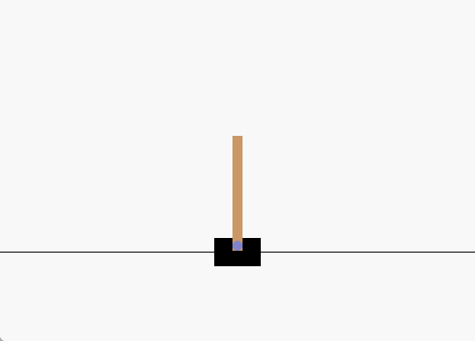

# learning-based-mppi
This repo provides a hand-made Python implementation of the learning-based Model Predictive Path Integral (MPPI) algorithm introduced in [Information Theoretic MPC for Model-Based Reinforcement Learning](https://ieeexplore.ieee.org/stamp/stamp.jsp?tp=&arnumber=7989202). In this repo, an online planner deployed with the MPPI algorithm is crafted to generate real-time control. A dynamic network used to approximate the system dynamics is incorporated for forward predictions. For the MPPI planner, **two versions of implementation** are provided: 
* A conventional version that accurately reflects the algorithm but involves longer computational time.
* A GPU-accelerated version that accelerate rollout through parallel computation, which is recommended.

The flexible and easily configurable code framework facilitates easy setup and further improvement. The algorithm is trained and evaluated on the [Gymnasium task Cart-Pole-v1](https://gymnasium.farama.org/environments/classic_control/cart_pole/).


## Installation
This is an example installation on CUDA == 12.1. For non-GPU & other CUDA version installation, please refer to the [PyTorch website](https://pytorch.org/get-started/locally/). We remark that this repo. does not depend on a specific CUDA version, feel free to use any CUDA version suitable on your own computer.

``` Bash
# create conda environment
conda create -n mppi python=3.8
conda activate mppi
pip install torch torchvision torchaudio --index-url https://download.pytorch.org/whl/cu121
```
### Gymnasium
``` Bash
# install gymnasium
pip install gymnasium[classic-control]
```
For other information about Gymnasium, please refer to [https://github.com/Farama-Foundation/Gymnasium](https://github.com/Farama-Foundation/Gymnasium).

## How to run
When your environemnt is ready, you can directly run with command:
``` Bash
python main.py
```
By default, this will cover three processes: **data collection**, **network training** and **evaluation** on the cart-pole swing up task. After training, the trained model will be saved in the "results" folder. For a quick evaluation without training, please setup the `model_load_path` in `main.py` with the path of the model to be evaluated and use command:
``` Bash
python main.py --if_train
```

Two versions of MPPI planner implementation can be found in the file `./algorithm/MPPI/mppi_planner.py` as the functions `plan` and `plan_gpu`, respectively. By default, the **MPPI planner with GPU acceleration** is used. If you want to use conventional version of MPPI planner without gpu acceleration, please use command:
``` Bash
python main.py --use_gpu_planner
```

For other parameters, please see in `config.py`.

## Evaluation Performance
Here we present GIF below to show an evaluation result on Gymnasium task Cart-Pole-v1.
||
|:-------------------------: |
|Evaluation Result|  
